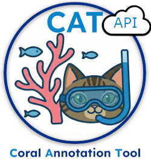

# Coral Annotation Tool (CAT) Tiles API Server
<a href="" target="_blank"></a>

**Cloud-Optimized GeoTIFF Tile Server for Coral Annotation Tool (CAT)**

A standalone FastAPI tile server designed for deployment to **Posit Connect**, enabling the CAT frontend to be hosted as a static sites while serving dynamic map tiles from Google Cloud Storage.

## Overview

This API provides TiTiler-based tile serving for Cloud-Optimized GeoTIFF (COG) files stored in **Google Cloud Storage public buckets**. It's specifically designed to work with the CAT annotation tool, allowing the frontend to remain static while tiles are served dynamically.

### Architecture

```
┌─────────────────────┐
│   GitHub Pages      │
│  (Static Frontend)  │
│   - HTML/CSS/JS     │
│   - Annotation UI   │
└──────────┬──────────┘
           │
           │ HTTP Requests
           │ 
           ▼
┌─────────────────────┐        ┌──────────────────┐
│  Posit Connect      │        │  Google Cloud    │
│  (CAT Tiles API)    │◄──────►│  Storage (GCS)   │
│   - FastAPI         │  Read  │  - Public COGs   │
│   - TiTiler         │  COGs  │  - gs:// URLs    │
│   - Dynamic Tiles   │        │                  │
└─────────────────────┘        └──────────────────┘
```

---

## 🚀 Features

- ✅ **TiTiler Integration** - Industry-standard dynamic tile generation
- ✅ **Google Cloud Storage** - Direct access to public GCS buckets
- ✅ **COG Optimized** - Efficient streaming of Cloud-Optimized GeoTIFFs
- ✅ **Multiple Formats** - Supports `gs://`, `/vsigs/`, and `https://` URLs
- ✅ **Metadata Endpoints** - Info, statistics, bounds, and preview generation
- ✅ **Health Checks** - Built-in monitoring endpoints
- ✅ **Optional Auth** - API key protection available

---

## 📋 Prerequisites

- Access to **Posit Connect** server
- Python 3.8+ (for local testing)
- `rsconnect-python` CLI tool
- COG files stored in a **public GCS bucket**

---

## 🛠️ Installation & Setup

### Local Development

```powershell
# Navigate to the cat_tiles_api directory
cd cat_tiles_api

# Install dependencies
pip install -r requirements.txt

# Run locally
python api.py
```

Visit:
- API: http://localhost:8000
- Docs: http://localhost:8000/docs

---

## 📡 API Endpoints

### Health & Info

| Endpoint | Method | Description |
|----------|--------|-------------|
| `/` | GET | Root endpoint with API info |
| `/health` | GET | Health check and configuration status |

### TiTiler Endpoints (requires `url` parameter)

All endpoints require a `url` query parameter with the COG file location.

| Endpoint | Description | Example |
|----------|-------------|---------|
| `/tiles/{z}/{x}/{y}` | Get map tile (XYZ) | `/tiles/10/512/384?url=gs://bucket/file.tif` |
| `/WebMercatorQuad/tiles/{z}/{x}/{y}` | Get map tile with TMS | `/WebMercatorQuad/tiles/10/512/384.png?url=gs://bucket/file.tif` |
| `/info` | Get raster metadata | `/info?url=gs://bucket/file.tif` |
| `/WebMercatorQuad/tilejson.json` | Get TileJSON (includes WGS84 bounds) | `/WebMercatorQuad/tilejson.json?url=gs://bucket/file.tif` |
| `/statistics` | Get raster statistics | `/statistics?url=gs://bucket/file.tif` |
| `/preview.png` | Get preview image | `/preview.png?url=gs://bucket/file.tif&max_size=512` |

----------
#### Disclaimer
This repository is a scientific product and is not official communication of the National Oceanic and Atmospheric Administration, or the United States Department of Commerce. All NOAA GitHub project content is provided on an ‘as is’ basis and the user assumes responsibility for its use. Any claims against the Department of Commerce or Department of Commerce bureaus stemming from the use of this GitHub project will be governed by all applicable Federal law. Any reference to specific commercial products, processes, or services by service mark, trademark, manufacturer, or otherwise, does not constitute or imply their endorsement, recommendation or favoring by the Department of Commerce. The Department of Commerce seal and logo, or the seal and logo of a DOC bureau, shall not be used in any manner to imply endorsement of any commercial product or activity by DOC or the United States Government.

#### License
This repository's code is available under the terms specified in [LICENSE.md](./LICENSE.md).

## Acknowledgments
- This project uses [TiTiler](https://github.com/developmentseed/titiler) by Development Seed for dynamic tile generation. TiTiler is licensed under the [MIT License](https://github.com/developmentseed/titiler/blob/main/LICENSE).
## Related Documentation

- [TiTiler Documentation](https://developmentseed.org/titiler/)
- [COG Specification](https://www.cogeo.org/)
- [Posit Connect User Guide](https://docs.posit.co/connect/user/)
- [rsconnect-python CLI](https://docs.posit.co/rsconnect-python/)